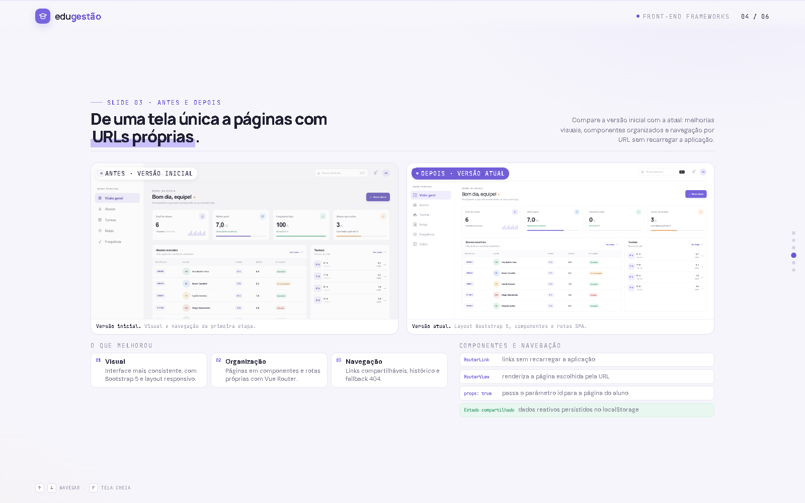
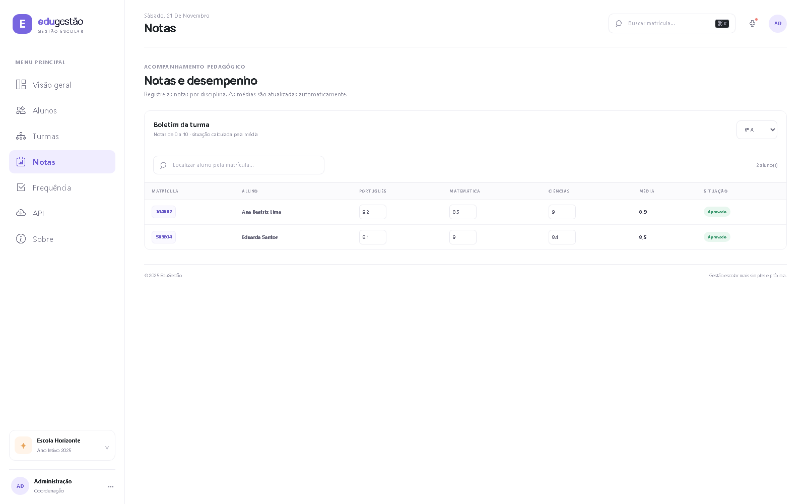
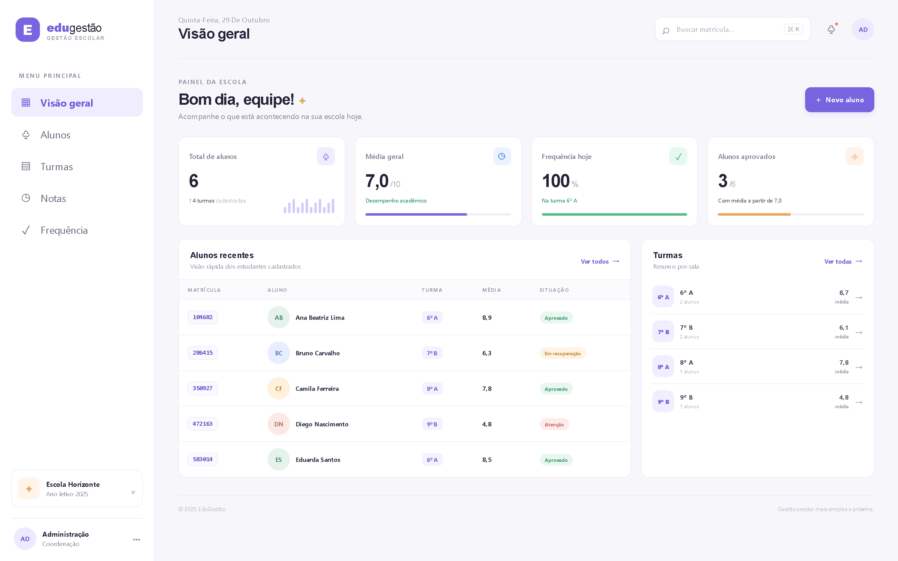
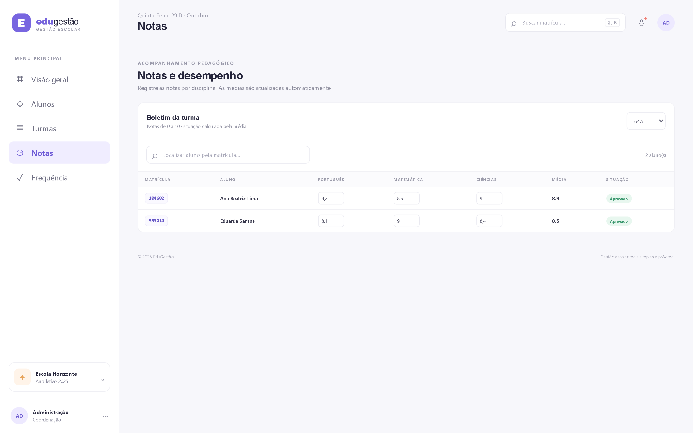

# 🎓 EduGestão

Painel responsivo de gestão acadêmica escolar para professores e coordenação, construído com **Vue 3**, **Vite** e **Bootstrap 5**. Permite cadastrar alunos, lançar notas, registrar frequência e acompanhar indicadores por turma.

[](https://vuejs.org/)
[](https://vite.dev/)
[](https://getbootstrap.com/)
[](#-navegação-spa-com-vue-router)
[](#-integração-com-api)
[](#-limitações-conhecidas)

---

## 📊 Apresentação

- **[Apresentação final — 5 slides](docs/apresentacao-final.md)** — pitch, demonstração, defesa técnica da integração com API e evolução do projeto. Formato Marp, exportável para PDF/PPTX.
- **[Deck navegável](https://rocksd2.github.io/EduGest-o/apresentacao/)** — apresentação sobre a evolução visual do painel e a navegação SPA. Use `↑`/`↓` para navegar e `F` para tela cheia.
- **[Baixar PDF](apresentacao/EduGestao-Bootstrap5.pdf)**.
- **[Roteiro de 5 minutos](apresentacao/roteiro.md)** — conteúdo e ordem da apresentação.

[](apresentacao/index.html)

[](https://rocksd2.github.io/EduGest-o/apresentacao/#slide-3)

---

## 🖼️ Telas

**Visão geral** — indicadores de matrículas, média escolar, aprovações e frequência do dia.

[](docs/preview.png)

| Alunos | Turmas |
| --- | --- |
| [](docs/alunos.png) | [](docs/turmas.png) |

| Notas | Frequência |
| --- | --- |
| [](docs/notas.png) | [](docs/frequencia.png) |

| Modal de cadastro | Mobile |
| --- | --- |
| [](docs/modal.png) | [](docs/mobile-menu.png) |

### Antes e depois: evolução do projeto

As capturas de **Antes** mostram a versão inicial; as capturas de **Depois**
foram atualizadas a partir da aplicação publicada. A comparação destaca a
evolução visual com Bootstrap 5 e as melhorias de arquitetura e navegação com
Vue Router.

| Antes (versão inicial) | Depois (versão atual) |
| --- | --- |
| [](docs/antes-visao-geral.png) | [](docs/preview.png) |
| [](docs/antes-alunos.png) | [](docs/alunos.png) |
| [](docs/antes-notas.png) | [](docs/notas.png) |

**Principais melhorias:** layout mais consistente e responsivo; páginas
organizadas em componentes; URLs próprias, histórico voltar/avançar e fallback
404. As capturas atuais de visão geral, alunos, turmas, notas e frequência
correspondem à versão publicada.

---

## 👥 Equipe

- Alexander Protasio de Brito
- Iarley Couto Mesquita
- Igor Carvalho Lira
- Joaquim Rodrigues Conceição
- Marlon Carneiro Oliveira
- Moisés de Aviz Lopes

---

## 📌 Sobre o projeto

Sistema criado a partir de uma necessidade real de sala de aula: professores e coordenadores precisam consultar e editar notas e informações dos alunos de forma simples. O EduGestão reúne essas tarefas em um painel único, com navegação por telas e indicadores calculados automaticamente.

É um protótipo funcional que agora também consome a **API pública DummyJSON** na tela de integração. Não há back-end próprio nem banco de dados: os cadastros continuam no `localStorage` do navegador. O Bootstrap 5 segue como framework CSS, com Bootstrap Icons, enquanto as páginas mantêm o tema próprio do EduGestão.

---

## ✨ Funcionalidades

**Visão geral**

- Painel com indicadores de matrículas, média escolar, aprovações e frequência.
- Cards responsivos com barras de progresso reativas.

**Alunos**

- Cadastro, edição e remoção de alunos.
- Busca por matrícula e filtro por turma.
- Matrícula numérica única de seis dígitos, gerada automaticamente.
- A matrícula **não** é derivada de CPF, CEP ou data de nascimento.

**Turmas**

- Consulta do número de estudantes e da média de cada turma.

**Notas**

- Lançamento de notas de Português, Matemática e Ciências.
- Cálculo automático da média e da situação do aluno (aprovado, recuperação ou atenção).
- Filtro por turma independente do filtro da tela de alunos.

**Frequência**

- Chamada diária com registro de presença ou ausência por aluno.
- Selos de status para presença, ausência e pendências.

**Integração com API**

- Busca de usuários na API pública DummyJSON com `fetch()` e requisições `GET`.
- Exibição do JSON recebido em cartões reativos, com estados de carregamento e erro.
- Importação de usuários para o cadastro da escola, com matrícula gerada e proteção contra duplicata.

**Geral**

- Persistência local dos cadastros, notas e registros de frequência no navegador.
- Layout responsivo (desktop, tablet e celular), com menu horizontal no mobile.
- Navegação SPA com Vue Router, URLs próprias, histórico do navegador e fallback 404.

## 🔌 Integração com API

| Item | Valor |
| --- | --- |
| API | DummyJSON (pública, gratuita, sem chave) |
| Endereço | `https://dummyjson.com` |
| Endpoint inicial | `GET https://dummyjson.com/users?limit=8` |
| Endpoint da busca | `GET https://dummyjson.com/users/search?q=<nome>&limit=8` |
| Formato | JSON (`{ users: [...], total, skip, limit }`) |
| Cliente | `fetch()` nativo em `src/dados/api.js` |

A tela `/integracao` carrega usuários ao abrir (`onMounted`) e refaz a busca com o nome digitado. `ref()` guarda resultados, carregamento e erro; `v-for` desenha os cartões; `v-if` mostra cada estado. O componente `CartaoUsuarioApi` emite o evento `importar` e a página chama `adicionarAluno()`, reaproveitando a regra de matrícula única. Falhas de rede ou respostas inválidas exibem um alerta com botão **Tentar novamente**.

## 🧭 Navegação SPA com Vue Router

O Vue Router exibe cada página dentro de `RouterView`. Os links do menu usam
`RouterLink`, então a URL e o histórico do navegador são atualizados sem
recarregar o documento. O estado compartilhado em `src/dados/escola.js` mantém
alunos, notas e frequência ao navegar entre páginas.

| Rota | Página |
| --- | --- |
| `/` | Visão geral |
| `/alunos` | Cadastro, busca e ações dos alunos |
| `/alunos/:id` | Detalhes, boletim e frequência individual |
| `/turmas` | Resumo das turmas |
| `/notas` | Lançamento de notas |
| `/frequencia` | Chamada diária |
| `/sobre` | Sobre o projeto e a navegação SPA |
| `/integracao` | Busca na DummyJSON e importação de alunos |
| Demais caminhos | Página 404 |

O roteiro dos quatro slides da etapa de rotas está em
[docs/apresentacao.md](docs/apresentacao.md); o roteiro da **entrega final (5 slides)**
está em [docs/apresentacao-final.md](docs/apresentacao-final.md). A demonstração
pode ser feita localmente com `npm run dev`, incluindo a navegação entre rotas,
a URL dinâmica de um aluno, a página 404 e a consulta à API.

---

## 🎨 Framework CSS: Bootstrap 5

### Como o Bootstrap é usado nesta versão

- Bootstrap 5 e Bootstrap Icons são dependências npm versionadas.
- `table-responsive` fornece rolagem horizontal nas tabelas em telas menores.
- Bootstrap Icons é usado nos ícones do menu.
- O layout e os componentes visuais mantêm o CSS próprio do EduGestão; os
  estados, formulários e a navegação ficam sob controle do Vue.

### Como foi integrado

Instalação via npm (recomendado em projetos Vite):

```bash
npm install bootstrap bootstrap-icons
```

Importação em `src/main.js`, **antes** do CSS do projeto:

```js
import 'bootstrap/dist/css/bootstrap.min.css'
import 'bootstrap-icons/font/bootstrap-icons.css'
import './assets/main.css'
```

O Bootstrap e os ícones são importados em `src/main.js` antes do CSS do
EduGestão, que mantém a identidade visual da aplicação. Os controles
interativos (navegação, formulário e modal) continuam sob controle do Vue,
sem inicializar um segundo framework JavaScript.

---

## 🧩 Organização Vue

- `src/App.vue` mantém o layout compartilhado, o menu com `RouterLink`, o
  cabeçalho, o modal de cadastro e o `RouterView`.
- `src/router/index.js` associa cada URL ao componente da página e configura o
  histórico, o título e a página 404.
- `src/views/` contém as páginas da visão geral, alunos, detalhes do aluno,
  turmas, notas, frequência, integração com API, sobre e 404.
- `src/views/IntegracaoView.vue` controla a busca, os estados da requisição e a
  importação; `src/components/CartaoUsuarioApi.vue` exibe cada usuário via props
  e emite o evento `importar` (comunicação entre componentes).
- `src/dados/api.js` concentra as requisições HTTP à DummyJSON.
- `src/dados/escola.js` centraliza os dados reativos, as regras de negócio e a
  persistência no `localStorage`, compartilhados por todas as rotas.
- `src/components/` preserva os componentes Vue da etapa anterior; os que não
  integram o layout atual continuam como legado.

---

## 📱 Responsividade

- **Desktop:** menu lateral fixo e painel responsivo em colunas.
- **Telas menores (≤ 820px):** menu lateral passa para o topo e pode rolar
  horizontalmente; o conteúdo usa a largura disponível.
- **Celular (≤ 560px):** busca do cabeçalho compacta, cards e filtros se adaptam
  à largura e as tabelas mantêm rolagem horizontal.
- **Acessibilidade:** foco visível, rótulos ARIA nos controles e navegação por
  links semânticos.

---

## 🚀 Como executar

### Pré-requisitos

- **Node.js 18+** instalado

### Passo a passo

```bash
# 1. Clone o repositório
git clone https://github.com/Rocksd2/EduGest-o.git

# 2. Entre na pasta
cd EduGest-o

# 3. Instale as dependências
npm install

# 4. Rode em modo de desenvolvimento
npm run dev
```

O Vite abre o projeto em `http://localhost:5173`.

Para gerar a versão de produção:

```bash
npm run build     # gera a pasta dist/
npm run preview   # serve a build localmente
```

---

## 🗂️ Estrutura do projeto

```
EduGest-o/
├── .github/workflows/deploy.yml   # publicação automática no GitHub Pages
├── apresentacao/                  # slides (HTML navegável, PDF e roteiro)
├── docs/                          # capturas, roteiros e apresentação final
│   └── apresentacao-final.md      # 5 slides da entrega final (Marp)
├── public/
│   └── favicon.svg
├── index.html                     # ponto de entrada + fontes
├── vite.config.js
├── package.json
└── src/
    ├── App.vue                    # layout compartilhado, modal e RouterView
    ├── main.js                    # Bootstrap + Vue + Vue Router
    ├── router/index.js            # rotas SPA
    ├── dados/api.js               # requisições GET à DummyJSON
    ├── dados/escola.js            # estado e regras compartilhados
    ├── views/                     # páginas por rota (inclui IntegracaoView.vue)
    ├── assets/
    │   └── main.css               # identidade visual do EduGestão
    └── components/
        ├── AppSidebar.vue
        ├── AppHeader.vue
        ├── CartaoUsuarioApi.vue   # cartão da API (props + emit)
        ├── ResumoCard.vue
        ├── StatusBadge.vue
        ├── FormAluno.vue
        ├── AppFooter.vue
        ├── ListaAlunos.vue        # legado (não usado)
        └── MembroEquipe.vue       # integrante exibido na página Sobre
```

---

## 🌐 Publicação no GitHub Pages

O projeto inclui o workflow `.github/workflows/deploy.yml`. Para publicar:

1. No GitHub, abra **Settings → Pages**.
2. Em **Build and deployment → Source**, selecione **GitHub Actions**.
3. Envie a branch `main`; o workflow faz o build e publica a pasta `dist`.
4. A aplicação fica disponível em `https://<usuario>.github.io/EduGest-o/`.

No GitHub Actions, o `vite.config.js` define `/EduGest-o/` como base de
publicação. O workflow também copia `index.html` para `404.html`, permitindo
que caminhos como `/EduGest-o/alunos/1` carreguem a SPA quando acessados
diretamente ou atualizados. Fora do Actions, o app usa `/` como base local.

---

## 🧠 O que foi praticado

- **Vue 3 com Composition API**: `ref`, `computed`, `watch`, `defineModel` e `nextTick`.
- **Estado derivado**: indicadores, médias e situações são calculados por `computed`, nunca armazenados duplicados.
- **Persistência no cliente**: serialização em JSON no `localStorage`, com `watch` de profundidade (`deep: true`) para salvar automaticamente.
- **Componentização**: divisão do `App.vue` em componentes com props, emits, `v-model` e slots.
- **Vue Router**: mapeamento de URLs para páginas, navegação com `RouterLink`,
  exibição com `RouterView`, rota dinâmica e página 404.
- **SPA em hospedagem estática**: configuração de base para GitHub Pages e
  fallback de navegação direta para rotas internas.
- **Integração Front-End × Back-End**: `fetch()`, JSON, estados de carregamento
  e erro, `v-for`/`v-if` para exibir dados externos e evento customizado entre
  componentes.
- **Framework CSS**: Bootstrap 5 e Bootstrap Icons instalados por npm, com
  utilitário `table-responsive`; estilos específicos preservam o tema do painel.
- **Responsividade**: breakpoints do CSS do projeto para o layout do painel.
- **Acessibilidade**: foco visível, rótulos ARIA e estados semânticos.

---

## ⚠️ Limitações conhecidas

- **Sem back-end próprio**: a API integrada é pública e de terceiros (DummyJSON); não há autenticação nem banco de dados. Os cadastros ficam no `localStorage` do navegador e **não são compartilhados** entre dispositivos ou usuários. A tela de integração depende de conexão com a internet.
- **Dados de demonstração**: a lista inicial é composta por alunos fictícios.
- **Sem controle de acesso**: qualquer pessoa com acesso ao navegador vê e edita tudo.
- **Sem histórico consolidado**: a chamada é registrada por dia, mas não há relatório de faltas por período.

Para uso real por uma escola, seria necessário integrar autenticação, servidor e armazenamento persistente.

---

## 🛣️ Próximos passos

- Evoluir a integração com `POST`, `PUT` e `DELETE` em uma API própria.
- Criar API com autenticação de professor e coordenação.
- Migrar os dados do `localStorage` para banco de dados.
- Adicionar relatório de faltas e boletim por bimestre.
- Exportar boletim em PDF.
- Escrever testes unitários dos cálculos de média e situação.

---

## 👤 Autor

**Alexander Protasio**

[](https://www.linkedin.com/in/alexander-protasio-26a84222a/)
[](https://github.com/Rocksd2)
[](mailto:alexanderprotasio@gmail.com)
